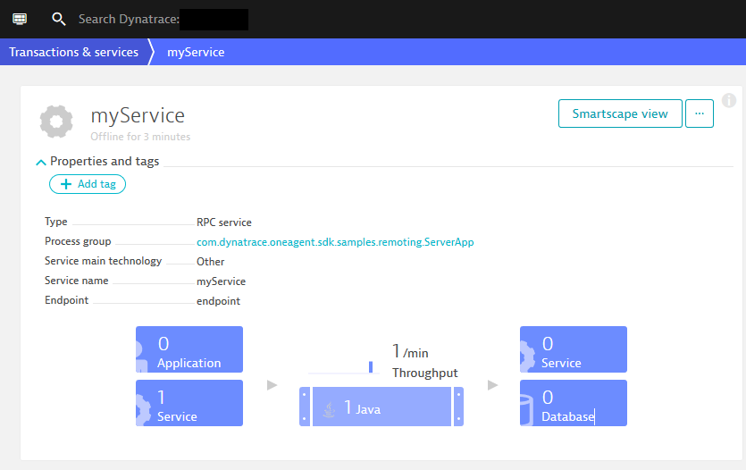
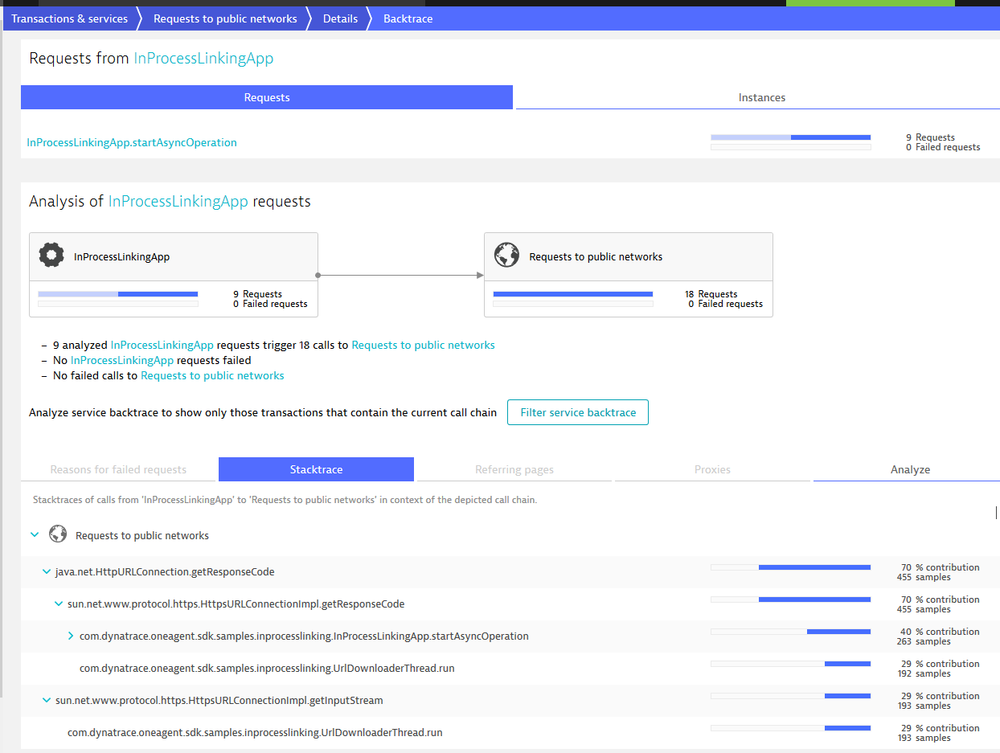
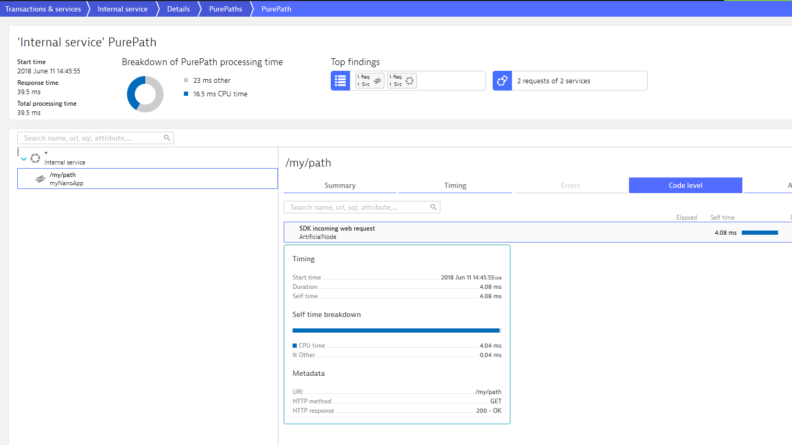

# Sample applications for OneAgent SDK for Java 

Sample applications showing how to use Dynatrace OneAgent SDK for Java to create custom specific PurePaths and service calls.

## Contents

- `remotecall`: shows usage of remote call API. Allows you to tag remote calls in the same or between different JVMs.  
- `in-process-linking`: shows usage of in-process-linking API. Allows you to tag eg. asynchronous execution inside the same process.

## Build and prepare running sample applications

- ensure you have Apache Maven 3.5 installed, see: [Apache Maven](https://maven.apache.org/)
- ensure Dynatrace OneAgent is installed. If not see our [free Trial](https://www.dynatrace.com/trial/?vehicle_name=https://github.com/Dynatrace/OneAgent-SDK-for-Java)
- clone this repository
- run `mvn package` in root directory of the desired sample

### Run RemoteCall sample application
This Application shows how to trace remote calls and tag them. To run this sample you need to start a server and client sample application - both with Dynatrace OneAgent injected.

- Server: `mvn -pl remotecall-server exec:exec`

- Client: `mvn -pl remotecall-client exec:exec`

Check your Dynatrace environment for newly created service like that:

### Run InProcessLinking sample application
This Application shows how to in-process-linking and custom service attributes are being used. To run this sample you need to create a custom service for your tenant - and of course Dynatrace OneAgent must be installed.

- ensure you have custom service for method `startAsyncOperation` in class `com.dynatrace.oneagent.sdk.samples.inprocesslinking.InProcessLinkingApp` 
- run sample: `mvn exec:exec`

Check your Dynatrace environment for newly created services like that:

### Run WebRequest sample application
This Application shows how to trace incoming webrequests. To run this sample you just go into the sample directory and run the sample by typing:

- run sample: `mvn exec:exec`

Check your Dynatrace environment for newly created services like that:

